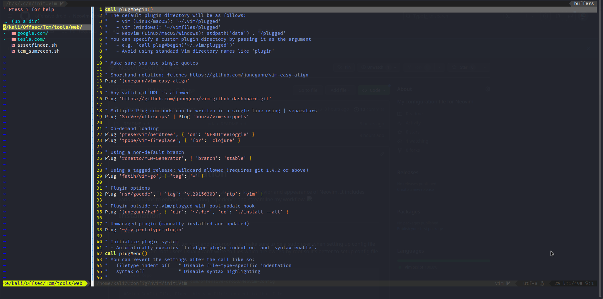

# Neovim Configuration

This is my Neovim configuration file that customizes the behavior and appearance of Neovim. It includes various plugins to enhance the editing experience and streamline my workflow.



## Installation
**❗Note:** 

The setup will be different for root and non-root. 
Just make sure to be a sudo user when setting up config file for neovim.
Non-root users usually can't write to files which are owned by root so it's better to setup config file for root.

```nix
#Clone Repo
$git clone https://github.com/offensive-droid/Neovim-Config

#Setup Config File, Place this vim file's content to that file.
$sudo mkdir ~/config/nvim
$sudo touch init.vim

# Install vimplug
Refer here: https://github.com/junegunn/vim-plug

#After vimplug is installed evoke this in Neovim to install Plugins.
:PlugInstall

#For Vim-Devicons to work
git clone https://github.com/powerline/fonts.git --depth=1
cd fonts
./install.sh
```

## Plugins

The configuration begins with the definition of plugins using the `plug` plugin manager. The following plugins are included:

### Appearance
- [vim-airline](https://github.com/vim-airline/vim-airline): Provides a sleek status line and tabline for Neovim.
- [vim-devicons](https://github.com/ryanoasis/vim-devicons): Adds fancy icons for various file types and directories.
- [awesome-vim-colorschemes](https://github.com/rafi/awesome-vim-colorschemes): A collection of beautiful color schemes for Neovim.
- [aura-theme](https://github.com/daltonmenezes/aura-theme): A theme to enhance Neovim's appearance.

### Utilities
- [vim-polyglot](https://github.com/sheerun/vim-polyglot): A collection of language packs for syntax highlighting and indentation.
- [auto-pairs](https://github.com/jiangmiao/auto-pairs): Auto-closes brackets, quotes, and other pairs in a smart way.
- [vim-css-color](https://github.com/ap/vim-css-color): Highlights CSS color codes in Neovim.

### Completion / Linters / Formatters
- [vim-markdown](https://github.com/plasticboy/vim-markdown): Enhances Markdown editing capabilities in Neovim.

### Git
- [vim-gitgutter](https://github.com/airblade/vim-gitgutter): Shows Git diff in the sign column and stages/unstages hunks.

### Code Completion
- [coc.nvim](https://github.com/neoclide/coc.nvim): A language server client for Neovim that provides code completion and more.
- [copilot.vim](https://github.com/github/copilot.vim): Integrates GitHub Copilot AI-assisted coding in Neovim.

## Colorscheme

The default colorscheme used in Neovim.

## Airline Settings

Custom settings for the `vim-airline` plugin.

## File Browser

Settings for the NERDTree file browser plugin.

## Options

Various settings for Neovim, including background color, clipboard behavior, line numbers, and more.

## Tabs Size

Settings related to tabs, including `expandtab`, `shiftwidth`, and `tabstop`.

## Syntax Highlighting

Enables syntax highlighting and sets the terminal color to 256 colors if available.

## Italics

If supported by the terminal, enables italics for certain text elements in Neovim.

## Coc Settings

Settings for the `coc.nvim` plugin for code completion and more.

## UltiSnips Settings

Settings for the `UltiSnips` plugin for code snippets.

## Coc-snippets Settings

Settings for the `coc-snippets` plugin for snippets integration with `coc.nvim`.
